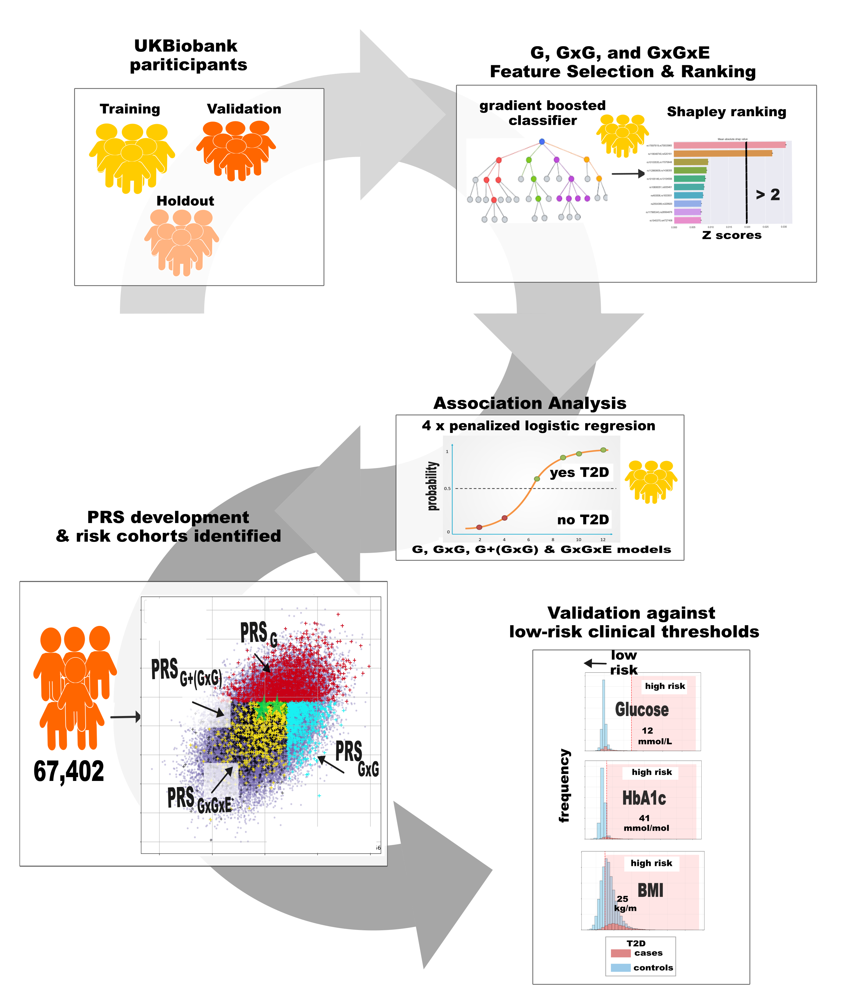
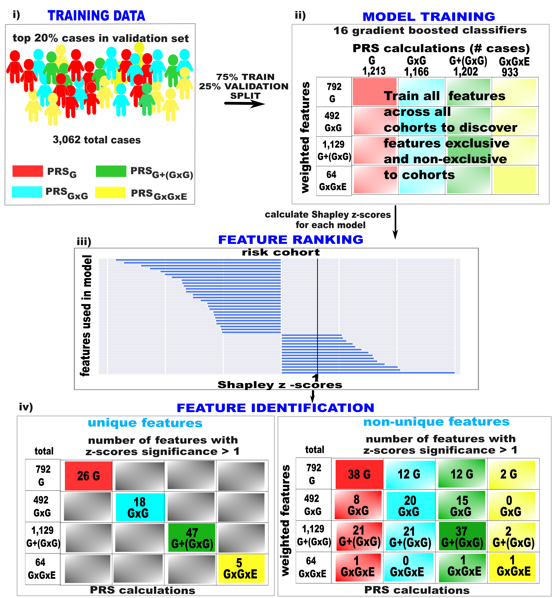

# OVERVIEW

The prs Insteractive pipeline was developed using genotyped, imputed HLA, and environmental data for UK Biobank participants with a European background. The pipeline is comprised of workflows for the inclusion of inclusion of gene (G), gene-gene (GxGxE), and gene-environment (GxE) interaction weights into polygenic risk (PRS) calculations for complex traits. The pipeline was developed and validated for type 2 diabetes (T2D) and celiac disease (CD) but can be applied to any trait with a ICD10 code and/or substring filter present in the Non-cancer illness code [instances 0-2] fields. Specific G, GxG, and GxGxE cohorts are further analysed to identify underlying features important to each cohorts to identify different molecular pathways driving risk within the cohorts.

# INPUT FILES NEEDED 

## participant.csv 

### ancestry filters used in development dataset
 Used in genetic principal components = Yes
 Outliers for heterozygosity or missing rate = NULL
 Sex chromosome aneuploidy = NULL
 Genetic kinship or other participants = NOT ANY OF Ten or more third-degree relatives identified
 Genetic ethnic groups = IS NOT NULL
 Genetic principal components | Array 1 = IS BETWEEN -20 - 40
 Genetic principal components | Array 2 = IS BETWEEN -25 - 10
File downloaded from cohort created using cohort browser on DNA nexus platform.

### Fields listed are minimum columns needed: 

| Fields | 
|----------|
| Participant ID  |
| Diagnoses - main ICD10  |
| Non-cancer illness code, self-reported \| Instance 0  |
| Non-cancer illness code, self-reported \| Instance 1  |
| Non-cancer illness code, self-reported \| Instance 2  |
| Non-cancer illness code, self-reported \| Instance 3  |
| Sex  |
| Genetic principal components \| Array 1  |
| Genetic principal components \| Array 2  |
| Genetic principal components \| Array 3  |
| Genetic principal components \| Array 4  |
| Genetic principal components \| Array 5  |
| Genetic principal components \| Array 6  |
| Genetic principal components \| Array 7  |
| Genetic principal components \| Array 8  |
| Genetic principal components \| Array 9  |
| Genetic principal components \| Array 10  |
| Age at recruitment  |

    
## raw variant calls in bed format

| variant files separated into chromosomes c(#) | 
|----------|
| ukb{project#}_c{#}_b0_v2.bed &emsp;   ukb{project#}_c{#}_b0_v2.bim &emsp; ukb{project#}_c{#}_b0_v2.fam|

## hla_participant.csv : imputed hla loci with values range from 0 - 2

### column headings are located in: ukb_hla_v2.txt 

## participant_environment.csv

| mandatory Fields | 
|----------|
| Participant ID  |
| EHF and environmental data  |

Electronic health record data for clinical markers for blood chemistry, blood counts, and cardiometabolic features.

Features used in analysis are listed in Supplemental Table S13 of thesis.

Workflow can use as input any clinical marker which includes blood counts, blood chemistry, and lifestyle data available at initial screening and follow up visits for all participants.
    

## withdrawals.csv
 A list of eid's provided by UK Biobank of people who have opted out of research. File consists of one column with no heading or index.

# WORKFLOW: 
##G, GxG, and GxGxE Analysis Overview using T2D data as an example

# Important Underlying Feature Analysis using T2D data as an example

# File Structure needed for running analysis

