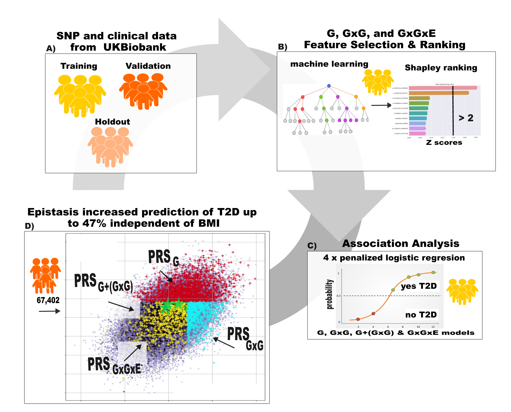

# OVERVIEW

The prs Insteractive pipeline was developed using genotyped, imputed HLA, and environmental data for UK Biobank participants with a European background. The pipeline is comprised of workflows for the inclusion of gene (G), gene-gene (GxGxE), and gene-environment (GxE) interaction weights into polygenic risk (PRS) calculations for complex traits. The pipeline was developed and validated for type 2 diabetes (T2D) and celiac disease (CD) but can be applied to any trait with a ICD10 code and/or substring filter present in the Non-cancer illness code [instances 0-2] fields. Specific G, GxG, and GxGxE cohorts are further analysed to identify underlying features important to each cohorts to identify different molecular pathways driving risk within the cohorts.


# FOLDER DIRECTORY

```bash

.
├── data
│   └── variant_calls
├── hpc
├── results
│   ├── epiFiles
│   │   └── preSummaryFiles
│   ├── figures
│   └── models
├── scripts
│   ├── helper
│   └── test
├── testData
│   └── variant_calls
└── workflows

15 directories

```


# INPUT FILES IN PRS/DATA/


hla_participant.csv #imputed HLA data
participant.csv #created on DNA nexus for study cohort
participant_environment.csv #created on the DNA nexus with environment variables
ukb_hla_v2.txt #downloaded from UKBiobank showcase
variant_calls/#bed/bim/bam files for chromosomes
withdrawals.csv (used to remove withdrawals in download)
withdrawalsID.txt (used to remove withdrawals in plink steps)

## participant.csv 

### ancestry filters used in development dataset
 Used in genetic principal components = Yes
 Outliers for heterozygosity or missing rate = NULL
 Sex chromosome aneuploidy = NULL
 Genetic kinship or other participants = NOT ANY OF Ten or more third-degree relatives identified
 Genetic ethnic groups = IS NOT NULL
 Genetic principal components | Array 1 = IS BETWEEN -20 - 40
 Genetic principal components | Array 2 = IS BETWEEN -25 - 10
File downloaded from cohort created using cohort browser on DNA nexus platform.

### Fields listed are minimum columns needed: 


| Fields | 
|----------|
| Participant ID  |
| Diagnoses - main ICD10  |
| Non-cancer illness code, self-reported \| Instance 0  |
| Non-cancer illness code, self-reported \| Instance 1  |
| Non-cancer illness code, self-reported \| Instance 2  |
| Non-cancer illness code, self-reported \| Instance 3  |
| Sex  |
| Genetic principal components \| Array 1  |
| Genetic principal components \| Array 2  |
| Genetic principal components \| Array 3  |
| Genetic principal components \| Array 4  |
| Genetic principal components \| Array 5  |
| Genetic principal components \| Array 6  |
| Genetic principal components \| Array 7  |
| Genetic principal components \| Array 8  |
| Genetic principal components \| Array 9  |
| Genetic principal components \| Array 10  |
| Age at recruitment  |

    
## variants/raw variant calls in bed format

| variant files separated into chromosomes c(#) | 
|----------|
| ukb{project#}_c{#}_b0_v2.bed &emsp;   ukb{project#}_c{#}_b0_v2.bim &emsp; ukb{project#}_c{#}_b0_v2.fam|

## hla_participant.csv : imputed hla loci with values range from 0 - 2

### column headings are located in: ukb_hla_v2.txt 


## participant_environment.csv

### Workflow can use as input any clinical marker which includes blood counts, blood chemistry, and lifestyle data available at initial screening and follow up visits for all participants.

| mandatory Fields | 
|----------|
| Participant ID  |
| EHF and environmental data  |

- Electronic health record data for clinical markers for blood chemistry, blood counts, and cardiometabolic features.

- Features used in analysis are listed in Supplemental Table S13 of thesis.


## withdrawals.csv
### A list of eid's provided by UK Biobank of people who have opted out of research. File consists of one column with no heading or index.
  

# OUTPUT FILES AND DIRECTORIES
  
# Output files and folder structure:

```
.
.pheno/
├── finalModel.ld
├── finalModel.log
├── finalModel.prune.in
├── finalModel.prune.out
├── finalModel.tags.list
├── finalModelLDSnps.txt
├── geneEnvironmentHoldout.csv
├── geneEnvironmentTest.csv
├── geneEnvironmentTraining.csv
├── holdoutCombined.bed
├── holdoutCombined.bim
├── holdoutCombined.fam
├── holdoutCombined.log
├── holdoutCombined.raw
├── holdoutCombinedRaw.log
├── holdoutID.txt
├── merged_allChromosomes.bed
├── merged_allChromosomes.bim
├── merged_allChromosomes.fam
├── merged_allChromosomes.log
├── merged_allChromosomes.snplist
├── combinedID.txt
├── testCombined.raw
├── testCombinedRaw.log
├── testID.txt
├── trainingCombined.raw
├── trainingCombinedRaw.log
├── trainingID.txt
├── pheno.config
├── epiFiles
│   ├── preSummaryFiles
│   │   ├── trainingEpi.epi.cc
│   │   ├── trainingEpi.epi.cc.1
│   │   ├── trainingEpi.epi.cc.N
│   │   ├── trainingEpi.epi.cc.summary.1
│   │   ├── trainingEpi.epi.cc.summary.N
│   │   └── trainingEpi.log
│   ├── trainingCombinedEpi.epi.cc.summary
│   ├── trainingCombinedEpi.epi.cc.summary.filtered
│   └── trainingCombinedEpi.log
├── figures
│   ├── AUC_metrics_table_{prs1/prs2..}.{nfeatures}.holdout.{mixed/protect/risk}.csv
│   ├── AUC_metrics_table_{prs1/prs2..}.{nfeatures}.validation.{mixed/protect/risk}.csv
│   ├── {prs1/prs2..}.{nfeatures}.holdout.{mixed/protect/risk}.AUC.png
│   ├── {prs1/prs2..}.{nfeatures}.validation.{mixed/protect/risk}.AUC.png
│   ├── {prs1/prs2..}.{nfeatures}.holdout.{mixed/protect/risk}.boxplot.png
│   ├── {prs1/prs2..}.{nfeatures}.validation.{mixed/protect/risk}.boxplot.png
│   ├── {prs1/prs2..}.{nfeatures}.holdout.{mixed/protect/risk}.densityPlot.png
│   ├── {prs1/prs2..}.{nfeatures}.validation.{mixed/protect/risk}.densityPlot.png
│   ├── {prs1/prs2..}.{nfeatures}.holdout.{mixed/protect/risk}.prevalencePlot.png
│   ├── {prs1/prs2..}.{nfeatures}.validation.{mixed/protect/risk}.prevalencePlot.png
│   ├── importantFeatureZscores.{batchIteration}.cardio.png
│   ├── importantFeatureZscores.{batchIteration}.epi.png
│   ├── importantFeatureZscores.{batchIteration}.main.png
│   ├── shap_summary_plot.{batchIteration}.cardio.png
│   ├── shap_summary_plot.{batchIteration}.epi.png
│   └── shap_summary_plot.{batchIteration}.main.png
├── models
│   ├── imp_mean_{epi/main}_{batchIteration}.pkl
│   ├── sklearnGradBoostHistClassifier_cardioMetabolic_{env1/env2..}.pkl
│   ├── sklearnGradBoostHistClassifier_{epi/main}_{batchIteration}.pkll
│   └── sklearnNaiveBayes_{epi/main}_{batchIteration}.pkl
└─── scores
    ├── cardio.{nFeaturesInPRS}.holdout.{mixed/protect/risk}.prs.csv
    ├── cardio.{nFeaturesInPRS}.validation.{mixed/protect/risk}.prs.csv
    ├── epi.{nFeaturesInPRS}.holdout.{mixed/protect/risk}.prs.csv
    ├── epi.{nFeaturesInPRS}.validation.{mixed/protect/risk}.prs.csv
    ├── epi+main.{nFeaturesInPRS}.holdout.{mixed/protect/risk}.prs.csv
    ├── epi+main.{nFeaturesInPRS}.validation.{mixed/protect/risk}.prs.csv
    ├── main.{nFeaturesInPRS}.holdout.{mixed/protect/risk}.prs.csv
    ├── main.{nFeaturesInPRS}.validation.{mixed/protect/risk}.prs.csv
    ├── all.{nFeaturesInPRS}.holdout.{mixed/protect/risk}.prs.csv
    ├── all.{nFeaturesInPRS}.validation.{mixed/protect/risk}.prs.csv
    ├── cardioMetabolicimportantFeaturesPostShap.csv
    ├── cardioMetabolicModelScores.csv
    ├── featureScores.csv
    ├── importantFeaturesForAssociationAnalysis.csv
    ├── importantFeaturesPostShap.csv
    └── sklearnModelScoresSections.csv


6 directories


```


# WORKFLOW OVERVIEW: 

## G, GxG, and GxGxE Analysis Overview using T2D data as an example




# RUN TEST WORKFLOW

## clone github repository to local machine

## INSTALL [miniconda](https://www.anaconda.com/docs/getting-started/miniconda/install, "Install instructions")

## Test Workflow overview

## creates and activates a conda environment ukb_env

## creates folders and results for type2Diabetes_test using steps:

- create simulation data in testData directory:
  + genotyped data
  + environmental data
  + hla data
  + covariate data
  
- use simulated data for all steps to calculating PRS for G, GxG, G+(GxG) and GxGxE datasets

- results will be found in the prsInteractive/results/type2Diabetes_test


``` 
cd prsInteractive/workflows/

bash run_workflow_test.sh

```


# RUN HPC WORKLOW 


## Pre step: setup environment variables, cleans input files for use in analysis, and creates and activate conda environment

### output of this step:

#### Directory prsInteractive/results/ will contain:

+ participant_environment.csv
+ participant_hla.csv
+ covar.csv and covar.txt (.txt for use in plink if needed)
+ pheno.config file

- create pheno specific directories in results/pheno/

+ scores/
+ figures/
+ models/
+ epiFiles/

* pheno = phenotype spelled in camel font and no spaces (i.e. type2Diabetes)
* icd10 code = substring present in the UK Biobank data (i.e. E11)
* pheno substring = will be exact spelling found in UKB data to check for if icd10 not present. this will have spaces so will need to wrap in " " (i.e. "type 2 diabetes")
* n = number of cores to pass to the epistatic analysis, with 40 cores being the norm and will take approximately 48 hours (i.e. 20)


```

$ cd /path/to/directory/prsInteractive


$ bash ../envSetUp.sh $pheno $icd10 "${phenoStr}" $n (# of cores on local machine)

```

## Run worflow

### 1) clean variants, starts fast-epistasis analysis using plink and begins batch feature reduction step for main (single SNPs)

#### input:
+ data/variant_calls/raw bed files for each chromosomes
+ ouput from envSetUp.sh

#### output to results/{pheno}/:

+ holdoutCombined.raw, testCombined.raw, trainingCombined.raw, testID.txt, holdoutID.txt, trainingID.txtmerged_allChromosomes.bed/bim/fam
+ updated pheno.config file to include updated file to create env variables downstream
+ epiFiles/ : trainingCombinedEpi.epi.cc.summary
+ scores/ : importantFeaturesPostShap.csv
  
```

$ cd path/to/prsInteractive/hpc

$ sbatch run_data_cleaning_workflow_submit.sh {pheno} {icd10 code}  {"sub string"} {n}
  
```
  

### 2) when fast-epistasis is complete, run the batch feature reduction for epi features

#### input to results/{pheno}/ :
 + output from step 2
 + scripts/filter_redundant_epi_pairs.py

#### output to results/{pheno}/

+ epiFiles/ : trainingCombinedEpi.epi.cc.summary.filtered
+ models/ : pickled gradient boosted for each batch used to filter GxG features previously filtered
+ scores/ : importantFeaturesPostShap.csv appended with epi features

```
  
$ cd path/to/prsInteractive/hpc
  
$ sbatch run_model_batches_submit.sh pheno "epi"
  
````

### 3) run the GxGxE interaction analysis

#### envStr = user decision which will be saved as ENV_TYPE and used in file names (i.e. cardioMetabolic was used in thesis)

#### input from results/{pheno}/ :

+ .raw files, participant_hla, participant_env, and covar files

#### Output in results/{pheno}: 

+ models/ :pickled gradient boosted models from for individual G, GxGxE, GxG , and E features
+ cardioMetabolicimportantFeaturesPostShap.csv (used downstream)

```

$ cd path/to/prsInteractive/hpc

$ sbatch run_gene_environment_feature_discovery_submit.sh pheno "envStr"

````

### 4) create combined EnvGeno matrix to be used downstream 

#### E features were mean centered, combined, and scaled after combining

#### statistics for validation set were used to transform features in holdout set 

#### input from results/ :

+ participant_hla, participant_env, and covar files
+ {pheno}/ : .raw files 
+ {pheno}/scores/ : cardioMetabolicimportantFeaturesPostShap.csv 

##### Output in results/{pheno}: 

+ geneEnvironmentTest.csv
+ geneEnvironmentHoldout.csv

```

$ cd path/to/prsInteractive/hpc

$ sbatch run_create_gene_env_data_submit.sh pheno 

````

### 5) run final association analysis with reduced features 

#### This will also calculate PRS across models for both validation and holdout sets.

#### Holdout sets will be scaled using mean and standard deviation of scaled validation set

#### Different scenarios are considered for LD occurring before or after glmNet modelling, due to previous workflow version in which it was done post modelling

#### input from results/{pheno}:

+ output from previous steps

##### Output in results/{pheno}: 

+ scores/ : individual PRS csv files with file name [{model}.{nFeatures}.mixed.prs.csv] if model = all then [{model}.{nFeatures}.{model}.FromAll.mixed.prs.csv]
+ scores/ : modelScoresReducedFinalModel.csv, predictProbsReducedFinalModel.csv, featureScoresReducedFinalModel.csv, featureScoresReducedFinalModel.filtered.csv (the additional GxGxE filter post modelling)
+ scores/ : combinedPRSGroups.csv, combinedPRSGroups.holdout.csv, combinedORPRSGroups.csv, combinedPrevalencePRSGroups.csv
+ figures/ : plots of prs calculations to include: AUC, AUC table, prevalence, boxplot, and prevalence plots with same file name (different suffix)
+ figures/ : combinedPRS.QQColorPlot.png (without combined (all) model results) and combinedPRS.withAll.QQColorPlot.png (with the high risk people from combined model)
+ figures/ : {prs prefix}.saturationPlot.png : saturation plot of mean diff in PRS calculations using top N features at a time. This is separated into risk, protect, and combined features 

```

$ cd path/to/prsInteractive/hpc

$ sbatch run_glmNetFinalModel.sh pheno 

````  
### 6) calculate PRS statistics 

#### input from results/{pheno}:

+ scores/ : combinedPRSGroups.csv

# Running analysis with WDL workflow
  
########## WORKING IN PROGRESS ########

### These instructions use the cromwell backend to compile .wdl workflow
###
### cromwell specific features include a cromwell.config file and command line instruction to start run
###

### Input

All inputs are required for from the root directory and annotated in the pipelineInputs.json file
Phenotype specific inputs are updated in first step
###

### Download cromwell 

Instructions for download can be found here: [cromwell download](https://cromwell.readthedocs.io/en/latest/tutorials/FiveMinuteIntro/)


#### Step 1: Setup Environment needed to run workflow

#### inputs:
* config/default.config
* data/
- covar.txt
- hla_participant.csv
- participant.csv
- participant_environment.csv
- ukb_hla_V2.txt
- withdrawals.csv


  
  
  


  

